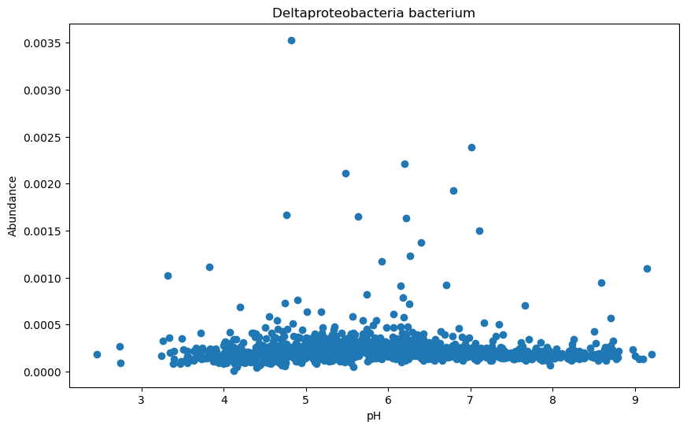
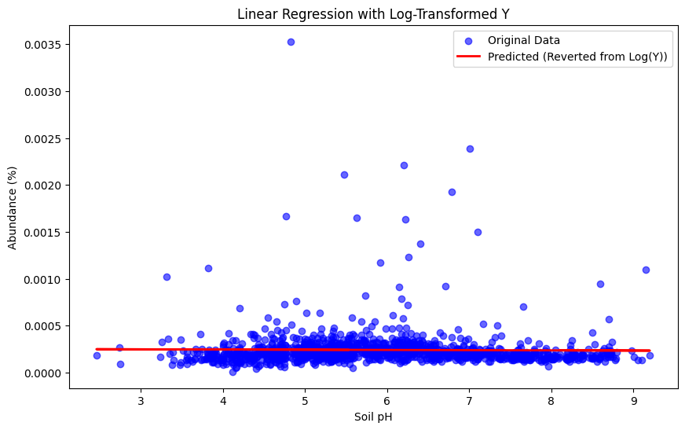
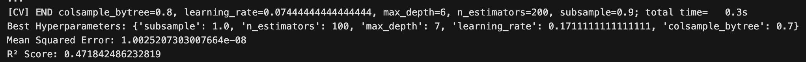
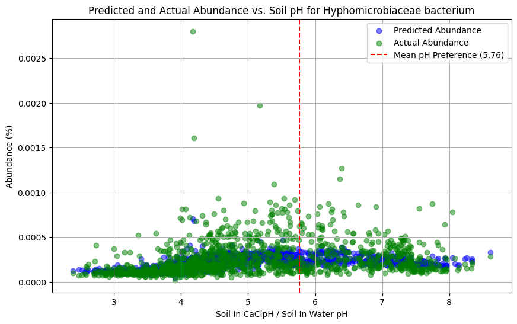

## Final Report

Code (instructions, dependencies, reproducibility, tests etc)
1) git clone (https://github.com/nmr2701/506-project)
2) install dependencies: `make install`
3) run the entire main pipeline.ipynb to see data cleaning and model creation as well as visuals with `make run`

Abundance data: https://github.com/zoey-rw/soil_microbe_GEMs/blob/master/comets_shinyapp_example/species_abundance_filt.csv
Organism data: https://github.com/zoey-rw/soil_microbe_GEMs/blob/master/comets_shinyapp_example/intermediate_data/organism_data_to_subset.csv

## Approach taken to reach goals:
This project followed a standard data science process—data exploration, cleaning, modeling, and evaluation—to ensure robustness, reliability, and alignment with the defined goals. During data exploration, we identified patterns and inconsistencies, and the preprocessing steps, such as handling missing values and feature engineering, were chosen to improve model performance. We used a 70/30 training-testing split and cross-validation for model generalizability, evaluating performance with metrics like R² and RMSE for regression tasks. Reproducibility was prioritized with well-documented code, a fixed random state, and visualizations to validate assumptions.

## Data description, relevance and provenance
The datasets used in this project are sourced from pre-existing files available in repositories such as soil_microbe_GEMs. Key files include:
species_abundance_filt.csv: Contains abundance data for various microbial species.
organism_data_to_subset.csv: Provides additional environmental preferences for the organisms, such as pH and temperature. 
We're utilizing 2 datasets in our project. The first dataset gives us a breakdown of the different microbial species in various samples. We get to see which species are most common, which are rare, and how they're distributed. 
The second dataset adds more context. We get information about the environment, like soil temperature and moisture levels, and where the samples were taken. This helps us understand how microbes interact with their surroundings. 

## Data Science Approach

**1) Data Exploration:**

Before building our model, we thoroughly explored the data to understand its structure, distribution, and potential challenges. We began by inspecting the datasets to examine their size, structure, and types of features, identifying numerical and categorical variables. We checked for missing values, visualizing them. This phase also helped uncover opportunities for feature engineering, such as combining or transforming features, while redundant or irrelevant features were flagged for removal. For classification tasks, we analyzed the distribution of the target variable to identify any class imbalances and considered appropriate strategies to address them. Exploratory visualizations, including scatter plots and bar charts, were used to uncover patterns and trends. These insights informed our preprocessing and modeling steps, ensuring a robust approach to addressing potential data challenges.
## Some plots to explore the data

 The actual abundance of Deltaproteobacteria bacterium in relation to soil pH. Each point represents an observed data entry, indicating how the abundance varies across different pH levels.

The relationship between soil pH and microbial abundance, comparing the average abundance of all species (blue line) with selected species. Each color-coded point represents the abundance of a specific species at a given pH value. The blue line highlights the overall trend, while individual species display variations that deviate from the average.

The most represented microbial species, ranked by the number of entries available for each. The top species, such as Deltaproteobacteria bacterium and Verrucomicrobiaceae bacterium, have the highest counts, indicating they are well-represented and likely to contribute significantly to the modeling and analysis.

The relationship between temperature and pathogen abundance. Each point represents a data entry, with the x-axis indicating temperature and the y-axis showing the corresponding abundance. Nost pathogens are observed within a specific temperature range, with decreasing abundance at higher temperatures. This provides insight into how environmental temperature influences pathogen prevalence, which can be important forpredictive modeling and understanding ecological interactions.

The relationship between pH levels and pathogen abundance. Each point represents a data entry, with the x-axis indicating pH values and the y-axis representing pathogen abundance. The data shows that pathogen abundance is concentrated within certain pH ranges, with a decline in abundance as pH levels increase

The scatter plot shows the relationship between temperature deviation (difference between observed and preferred temperature) and species abundance. Most data points cluster around lower deviations, indicating the species thrives near its preferred temperature, with fewer outliers at higher deviations where abundance decreases.

## 2) Data Cleaning:

Loading Data: The two datasets are loaded and merged based on a shared species identifier to align abundance data with environmental factors. We realized we incorrectly did this in the midterm part. We were introducing a lot of duplicate rows as the species files had duplicates.
Handling Missing Values: Missing data is addressed by imputing mean values for numerical columns to avoid disrupting the model training process.

Merging Data: Had to merge the datasets since we needed the ‘percentage’ column from the abundance data as the target for our modeling. Rows with duplicate entries are removed to ensure data consistency when merging the datasets. Initially, we didn’t do this correctly for the midterm report therefore the shape of the merged file was not what we expected. It was significantly bigger. We have now removed the duplicates to ensure that the merged file is now the same size as the abundance data file. We also made sure that we removed species where there was not enough data for it to be impactful in the model.

## 4) Feature Engineering 

Feature engineering was a crucial step in enhancing the model's ability to capture meaningful relationships within the data. The process involved creating new features, transforming existing ones, and extracting valuable information that could improve model performance. Here's a detailed explanation of the feature engineering steps undertaken:
Interaction Features:
- We created interaction terms by combining variables that may have a combined effect on the target variable. For example, **temp_soilMoisture** was derived by multiplying **temperature_preference** and **soilMoisture**, as we hypothesized that the interaction between temperature preference and moisture levels could affect species abundance.
Product of pH Variables:
To capture the relationship between different pH measurements, we created the **soilInWaterpH_soilInCaClpH** feature by multiplying the **soilInWaterpH** and **soilInCaClpH** variables. This interaction may provide insights into how these two pH levels collectively influence the abundance of species in the soil.
Squared Features:
- To capture non-linear effects, we squared certain continuous variables. For instance, **temperature_preference_squared** and **pH_preference_squared** were introduced to help the model recognize non-linear relationships between environmental preferences and species abundance. Similarly, squaring soilMoisture helped to account for any non-linear impact of moisture on species presence.
Geographical Features:
- We added geographical information by calculating the absolute values of latitude and longitude to create **distance_from_equator** and **distance_from_prime_meridian**. These features help account for environmental factors tied to a species’ location, such as climate patterns that may influence their abundance.
Species-Specific Averages:
- We calculated the average soil temperature (avg_soilTemp_by_species) and pH (avg_ph_by_species) for each species. These values, mapped to each row, provide context on the typical environmental conditions for each species, allowing the model to recognize the conditions under which a species is most abundant.
Standard Deviation from Preferences:
- We calculated the standard deviation of soil pH (sd_ph_from_preference) and soil temperature (sd_temp_from_preference) relative to the species' preferred conditions (pH_preference and temperature_preference). These features were created to capture the variation between actual and preferred environmental conditions, which may influence how well a species thrives under varying conditions. The standard deviation was computed by first squaring the differences and then taking the square root to obtain the actual measure of variation.
Handling Missing Values of New Features:
- Missing values were handled by filling them with the mean of the respective column. This step ensured that no data points were excluded from the analysis due to missing values, which could have otherwise introduced bias or reduced the dataset size.
These engineered features allowed the model to better understand complex interactions between environmental conditions and species abundance, improving predictive accuracy and ensuring the model was more robust in identifying key relationships within the dataset.

## 5) Modeling 

In this project, we experimented with several machine learning models to find the best approach for predicting species abundance based on environmental and geographical factors. The models we tried included Logistic Regression, Linear Regression, Gaussian Mixture Model (GMM), Random Forest, XGBoost, and a Neural Network. Each model was evaluated based on its performance and suitability for the dataset, and we adjusted the features and hyperparameters to optimize the results.

We approached model creation with two hypotheses: building a general model for all organisms versus creating separate models for each organism. The goal was to determine whether a unified approach could capture the overall trends or if organism-specific models would yield better accuracy due to unique behaviors in abundance patterns.

## Organism Specific Models:

## Linear Regression:
- Linear Regression was used as the baseline simple model for predicting species abundance, with the assumption that there might be a linear relationship between the features and the target. The model performed reasonably well, but it struggled to capture more complex, non-linear relationships within the data, particularly given the interactions and squared terms that were part of our feature engineering.
  
## Polynomial Regression:
- To better capture the non-linear relationships in the data, we extended Linear Regression by using Polynomial Regression. This method allows for the fitting of polynomial terms to the features, enabling the model to learn more complex patterns. While Polynomial Regression improved the model's ability to capture these non-linearities, it still faced limitations. The model was prone to overfitting, especially when higher-degree polynomials were used, and it did not outperform other more advanced models, such as Random Forest or XGBoost.
  
## Gaussian Mixture Model (GMM):
- Gaussian Mixture Models were explored to see if there were latent subgroups within the data that could explain the variability in species abundance. GMM is a probabilistic model that assumes the data is generated from a mixture of several Gaussian distributions. However, it was not able to capture the underlying patterns as effectively as other models, and its performance was limited due to the continuous nature of the target variable and the complexity of the dataset.
 
## Random Forest:
- Random Forest was a strong contender due to its ability to handle complex datasets and capture non-linear relationships without requiring explicit feature engineering. It performs well by averaging multiple decision trees, reducing overfitting. Random Forest was able to capture interactions between features and was more robust compared to linear models, but it was still outperformed by more advanced models like XGBoost.

Initially, our focus was on creating organism-specific models, aiming to capture the unique abundance patterns for each species. However, despite extensive experimentation with feature engineering and various modeling approaches, the metric scores for these models consistently fell short, showing little to no improvement regardless of adjustments. A significant limitation stemmed from the small size of the datasets, with most organism-specific models based on only around 1,000 rows of data—a volume insufficient to capture the complexity of abundance predictions. This prompted us to explore a unified modeling approach, hypothesizing that combining data across organisms might uncover overarching trends and improve predictive accuracy by leveraging a larger, more diverse dataset.

While a unified model might overlook the intricacies of individual species, it offers the advantage of pooling data from across organisms, providing a much larger dataset. This approach allows us to identify general patterns and trends in species abundance that might not be apparent when focusing solely on a single species. The increased data volume enhances the model’s ability to capture broader trends, ultimately boosting overall accuracy and making it more robust in predicting species abundance patterns, even if it means sacrificing some of the specific nuances of each organism.

## Models that we trained on both specific organisms and all of the data:

## XGBoost:
- XGBoost emerged as one of the most powerful models for this project. As a gradient-boosting algorithm, it excels at capturing complex non-linear relationships and interactions between features, making it highly effective for regression tasks with structured data. After using RandomizedSearchCV for hyperparameter tuning, XGBoost achieved the best results, showing superior performance in terms of the R² score and Mean Squared Error (MSE) compared to other models. The ability to tune multiple hyperparameters, such as tree depth, learning rate, and subsample ratio, further enhanced the model’s performance.
  ### General XG Boost Model
  

  ### Organism-Specific XG Boost Model
  
  
## Neural Network:
- Finally, we experimented with a Neural Network. Neural networks are powerful tools for capturing highly complex relationships in large datasets, and their ability to learn non-linear patterns can provide valuable insights. The architecture included three hidden layers with 256, 128, and 64 neurons respectively, ReLU activations, dropout for regularization, and batch normalization to stabilize training. However, the neural network did not outperform XGBoost in this case. Training the neural network required more data and computational power, and despite our efforts to tune the model, its predictions were notably flat and failed to capture the true patterns in the data. This indicated an underfitting issue, where the model struggled to learn the complexities of the target variable. Additionally, our lack of experience with neural networks may have hindered our ability to leverage their full potential. Despite these challenges, the neural network demonstrated some ability to learn non-linearities in the data, but it was ultimately less efficient and effective for this problem compared to XGBoost, which remained the superior choice in terms of performance and computational efficiency.

  ### General Neural Network Model
  

  ### Organism Specific Neural Network Model
  
  
## Model Comparison and Evaluation

We evaluated each model using R² (coefficient of determination) and Mean Squared Error (MSE) as the primary metrics. While Linear Regression provided a simple baseline, more complex models like Random Forest and XGBoost outperformed it by capturing non-linear patterns in the data. XGBoost consistently delivered the best results, particularly after hyperparameter tuning with RandomizedSearchCV.
Linear Regression performed well but was limited in its ability to capture complex interactions.
Random Forest was a solid performer but was still outshined by XGBoost in terms of predictive power.
Neural Networks showed potential but required extensive tuning and did not provide a clear advantage over XGBoost.
Ultimately, XGBoost was selected as the final model due to its superior performance in predicting species abundance, particularly after optimizing the hyperparameters.

## 6) Evaluating and tuning the Model 
In order to optimize the performance of the model, we employed RandomizedSearchCV to perform a hyperparameter search for the final XGBoost model. This method allowed us to efficiently explore a wide range of hyperparameters and identify the best combination to improve model performance.
## Hyperparameter Optimization with RandomizedSearchCV:
- We defined a set of hyperparameters to tune, including the number of estimators (n_estimators), maximum tree depth (max_depth), learning rate (learning_rate), subsample ratio (subsample), fraction of features sampled (colsample_bytree), and minimum loss reduction for split (gamma).
By using RandomizedSearchCV, we were able to explore a large space of possible hyperparameter combinations while maintaining computational efficiency by setting a limit on the number of iterations (n_iter=50).
The cross-validation (cv=5) ensured that the model's performance was robust and not overfitting to a specific training fold.
The scoring metric used for evaluation was R² (coefficient of determination), which provided a measure of how well the model explained the variance in the target variable.
After running the randomized search, we retrieved the best hyperparameters and evaluated the R² score achieved during cross-validation. This allowed us to assess how well the optimized model was likely to perform on unseen data.
## Model Evaluation:
- After identifying the best hyperparameters through RandomizedSearchCV, we evaluated the optimized model on the test set using R² and Mean Squared Error (MSE). The R² score provided insight into the model’s goodness-of-fit, while MSE quantified the average squared difference between the predicted and actual target values.
This step validated the performance of the optimized model on data that it had not previously seen, providing a more reliable measure of its predictive capability.

This was our initial statistics for the first XGBoost model as we can see the r^2 value is not to bad but also not to good either. We also observe that the means squared error seems to be on the higher side showing the points are more scattered around the mean abundance.

This was our 2nd working of the XGboost model. We can see that the r^2 value has dropped pretty significantly. However, we were able to drop the mean squared error by half making the points closer to the mean abundance.

This is our current working model's stats. We can see for this one we have a better r^2 value compared to the other 2 variations of the model we tried. We also have the lowest mean squared error value as well for this model. With this we decided this was our best model for predicting the distribution of the abundance of a given species.

## Feature Importance:
- One of the key benefits of using XGBoost is its ability to provide feature importance scores, which highlight the relative contribution of each feature to the model’s predictions.
After training the optimized model, we plotted the feature importance to identify which features were most influential in predicting species abundance. Features with higher importance scores were those that the model found to have a stronger relationship with the target variable.

The feature importance plot allowed us to visualize which engineered features (e.g., temp_soilMoisture, avg_soilTemp_by_species, sd_ph_from_preference) had the greatest impact on the model’s predictions, providing useful insights into the dataset's structure.
## Experimenting with New Features:
- As part of the evaluation process, we experimented with adding and removing features to assess their impact on model performance. For example, after observing the feature importance scores, we decided to experiment with new engineered features like the interaction term between soil pH and temperature preferences, which seemed to offer a meaningful relationship with species abundance.
We also explored variations in the distance-based features (such as distance_from_equator and distance_from_prime_meridian) to capture more detailed geographical patterns. These modifications aimed to improve the model by providing it with more relevant data that could better explain variations in the target variable.
## Visualization of Results:
Finally, we visualized the results of the model’s predictions against the true values to assess how well the model performed in real-world scenarios. A scatter plot was generated to show the relationship between the actual and predicted abundance values, offering a clear indication of the model's accuracy.
The feature importance graph further clarified the role of each feature in the model, reinforcing the value of specific features and supporting decisions about which features to retain or modify in future iterations of the model.

The predicted and actual abundance of Deltaproteobacteria bacterium relative to soil pH. The red dashed line represents the mean pH preference (5.29) for this organism. The blue points indicate the predicted values, while the green points represent the actual abundance data. The model captures the general trend of abundance peaking near the mean pH preference, though there are some deviations where predictions diverge slightly from the actual values. This suggests the model is effective overall but may have limitations in accurately capturing variations in areas with lower abundance.

Compares the predicted and actual abundance of Verrucomicrobiaceae bacterium relative to soil pH. The red dashed line marks the mean pH preference (8.88) for this organism. Blue points represent the predicted values, while green points show the actual abundance. The model effectively captures the abundance trend but shows some variation, particularly at pH levels farther from the organism's preference. 

This plot illustrates the predicted and actual abundance of Hyphomicrobiaceae bacterium relative to soil pH. The red dashed line marks the mean pH preference (5.76) for this bacterium. The blue points represent the predicted abundance, while the green points indicate the actual values. The model aligns well with the general trend of abundance peaking near the preferred pH, although discrepancies appear in regions with sparse data or lower abundance. This indicates the model's effectiveness overall, with minor limitations in predicting outliers.

This plot compares the predicted and actual abundance of Methylobacterium oryzae relative to soil pH. The red dashed line indicates the mean pH preference (8.61) for this species. The blue points represent the predicted abundance, while the green points reflect the actual data. The model shows general alignment near the organism's preferred pH, though the low abundance across most pH ranges highlights the difficulty in accurately modeling rare species distributions. 

Depicts the predicted and actual abundance of Nonomuraea sp. NEAU-A123 as a function of soil pH. The red dashed line represents the mean pH preference (2.39) for this species. Blue points indicate the predicted abundance, while green points reflect the actual data. The model captures the general trend of abundance near the mean pH preference.

## Overall results and conclusion
In conclusion, we were somewhat successfully integrated and analyzed two datasets to explore the relationship between environmental factors and microbial species abundance. Through a detailed data science approach, including exploration, cleaning, and feature engineering, we ensured that the datasets were properly prepared for modeling. Our exploration uncovered key patterns and informed the creation of features that enhanced the models' ability to capture meaningful relationships in the data.
Among the various models tested, XGBoost emerged as the best-performing model for predicting species abundance, demonstrating superior accuracy and robustness compared to simpler approaches like Linear Regression and more complex ones like Neural Networks. By employing hyperparameter tuning with RandomizedSearchCV, we further optimized the XGBoost model, achieving strong performance metrics and insights into the interactions between environmental variables and microbial species.
## Improvements
The results demonstrate the potential for leveraging predictive modeling to better understand how environmental factors influence microbial populations.
We could have improved our approach by if we additional environmental factors, such as climate or soil nutrient data, to provide a more comprehensive analysis. Using a more systematic feature selection process could have enhanced model interpretability and reduced computational overhead. Exploring advanced techniques, such as stacking models or gradient-boosted random forests, might have further improved performance. Additionally, validating the model on independent datasets would have tested its generalizability and real-world applicability. These refinements could have made our analysis more robust and impactful.

